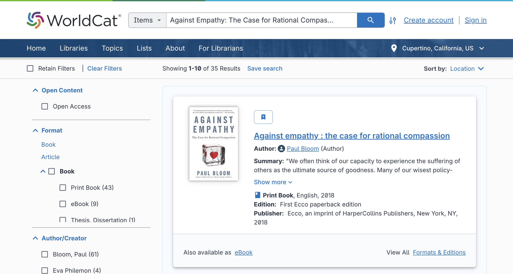
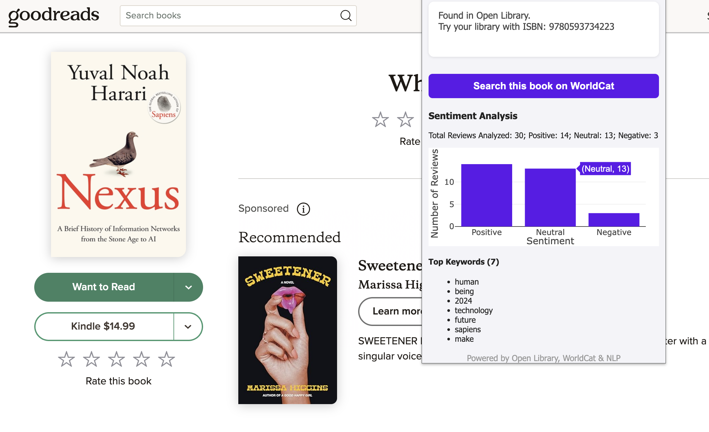

# Goodreads Companion (Chrome Extension)  
### Browser Extension for Book Metadata Extraction, Review NLP, and Library Availability

> A fully client-side Chrome Extension that enhances Goodreads with intelligent features such as real-time metadata parsing, review sentiment classification, and library availability lookup, with zero backend dependencies.

---

## Motivation

Goodreads provides a host of user-generated reviews and metadata, but lacks semantic tooling or personalized insights. This extension bridges that gap by introducing intelligent augmentation directly in the browser, with a focus on natural language understanding and user-centric features like ZIP-based library lookup.

This project showcases:

- Client-side NLP and rule-based AI  
- Chrome Extension architecture (Manifest V3)  
- Structured data extraction from live web content  
- UX-driven product design with privacy by default  
- Data visualization and stateful UI rendering  

---

## Features

- **Real-Time Metadata Extraction**  
  Parses embedded `ld+json` (JSON-LD) for structured book metadata: `title`, `author`, and `ISBN`.

- **Review Sentiment Analysis (Local NLP)**  
  Uses a lexicon-based classifier to analyze Goodreads user reviews into *positive*, *neutral*, or *negative* sentiment.

- **Sentiment Visualization with Plotly.js**  
  Displays classified review distribution using an interactive bar chart.

- **Keyword Theme Extraction**  
  Extracts dominant review topics using frequency analysis with stopword filtering (excludes trivial/book-specific terms).

- **Library Availability Lookup**  
  - Uses Open Library API for real-time book lookup via ISBN or fallback to title/author.  
  - Generates dynamic WorldCat search links using the user’s ZIP code (stored in Chrome secure storage).

- **Persistent ZIP Code Storage**  
  User's ZIP is saved using `chrome.storage.sync` and auto-filled on return visits.

---

## 🏗️ Architecture Overview

| Component      | Purpose |
|----------------|---------|
| `content.js`   | Injected into Goodreads pages. Extracts structured metadata and DOM-based review content. Sends payload to popup UI. |
| `popup.js`     | Handles ZIP code retrieval, API lookups, review classification, keyword extraction, and chart rendering. |
| `manifest.json`| Follows Manifest V3 structure for background permissioning, content script injection, and UI handling. |

---

## Tech Stack

| Layer | Tools / APIs |
|-------|--------------|
| Language | JavaScript (ES6+) |
| Runtime | Chrome Extension (Manifest V3) |
| Parsing | JSON-LD, DOM |
| NLP | Lexicon-based rule engine |
| Visualization | Plotly.js |
| Storage | `chrome.storage.sync` |
| External APIs | Open Library REST API, WorldCat URL query |

---

## Setup & Installation
1. **Clone the repository**

   ```bash
   git clone https://github.com/ananyadua27/Goodreads-companion.git
   cd Goodreads-companion

2. Load the Extension in Chrome
   - Navigate to chrome://extensions
   - Enable Developer Mode
   - Click "Load unpacked"
   - Select the project root 

---

## Example Interface

 and check availability")





---

## Sentiment Analysis

- A simple lexicon-based classifier is implemented for local sentiment analysis.
- Review text is tokenized and compared against curated sets of positive and negative keywords.
- Each review receives a numerical score:
  - Positive if score > 0
  - Neutral if score = 0
  - Negative if score < 0
- Results are visualized as a bar chart using Plotly.js.
- This approach prioritizes privacy, performance, and zero-dependency deployment.

---

## Keyword Extraction

- Stopword filtering based on an extended domain-specific stopword list.
- Frequency analysis across all review tokens.
- Top N frequent nontrivial keywords are surfaced as dominant review themes.
- Book title and author words are dynamically excluded.

---

## API Details

**Open Library (Book Availability)**  
- ISBN Lookup:  
  `https://openlibrary.org/api/books?bibkeys=ISBN:{isbn}&format=json&jscmd=data`  
- Title/Author Fallback:  
  `https://openlibrary.org/search.json?title={title}&author={author}&limit=3`

**WorldCat (Library Search)**  
- Location-based query via dynamic URL:  
  `https://www.worldcat.org/search?q={title}+{author}`

---

## Security & Privacy

- All processing occurs in-browser; no data is transmitted to third-party servers.
- The extension does not track user behavior, install background listeners, or require external authentication.
- Book data and ZIP code are only used for availability lookups and stored locally using Chrome's secure storage API.

---

## Potential Upgrades

- Upgrade sentiment model to a transformer-based classifier.
- Enable caching of book lookups and review summaries.
- Implement bookmarks or reading list functionality with export options.

---

## License

MIT License © Ananya Dua